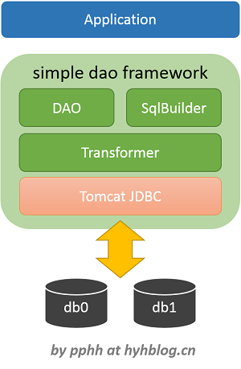
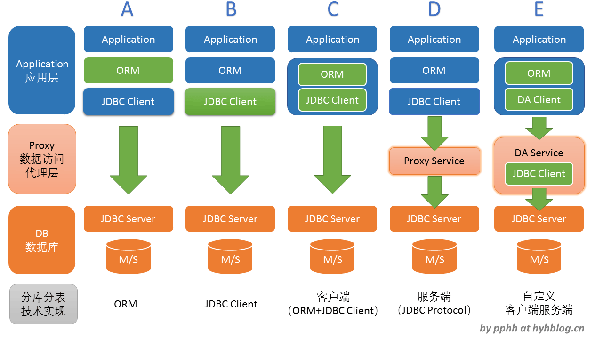
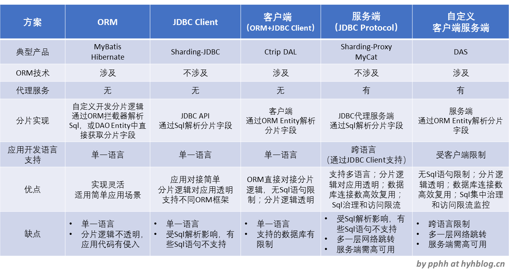

# simple-dao-framework

## 1. 项目介绍

本项目以尽量简洁的方式实现一个数据访问框架实现，包括dao/orm/sqlbuilder/jdbc/分库分表等核心技术栈。框架功能包括，

- dao/entity 抽象逻辑数据库，实现数据实体的基本增删改查、批量和事务操作（注：事务功能待实现），透明分库分表
- sqlbuilder 动态的sqlbuilder，支持灵活的sql语句生成
- orm 兼容JPA，并为sqlbuilder提供字段定义，方便使用sqlbuilder构建
- jdbc 实现分库，对接数据库连接池。

项目主要参考了两个开源项目的技术实现，结合了它们各自的特点，取长补短，

- [Ctrip Dal](https://github.com/ctripcorp/dal) 覆盖ORM和JDBC两个技术栈的数据访问客户端，提供便利的entity/dao/sqlbuilder，便于开发者快速上手，支持分库分表。
- [jOOQ](https://github.com/jOOQ/jOOQ) 能够通过Java动态构建类型安全的Sql语句，其数据访问可分为Sql的构建代码生成、执行和结果收集三部分。

为开发者提供更加友好、易用的数据访问技术方案，通过逻辑库概念实现分库分表。

## 2. 技术架构

项目的技术架构图和调用关系如下，




整个架构，技术栈层次简单清晰，可扩展性好。

## 3. 项目结构

整个项目目录结构如下，

```
- pom.xml 整个Maven项目的pom文件，这是项目的根目录
+ dao-core 核心抽象模块
  - pom.xml
  + src
    + main/java/com/pphh/dfw/core
      + ds 数据库访问源data source配置
      + table 表实体结构定义
      + dao 数据访问对象，提供对entity对象的增删改查接口
      + sqlb 动态sql构建器
      + transform sql任务执行中心
      + jdbc JDBC client
+ dao-framework 数据库访问框架
  - pom.xml
  + src
    + main/java/com/pphh/dfw
      + config 配置（本地配置文件、远程配置中心）
      + table 通用表和抽象表的实体结构定义
      + sqlb 动态sql构建器的实现
      + shard 分片策略
      + jdbc Tomcat JDBC实现
      - DAO 数据访问对象的实现
+ dao-test 测试项目
  - pom.xml
  + src
    + main/java
    + test/java 单元测试
      + com/pphh/dfw
        + dao 数据访问对象的单元测试，包括各种分库分表方案
        + sqlb 动态sql构建器测试
        + hints
        + config 配置测试
        + transaction 事务测试
    + test/resources
        - dfw-db-config.properties 逻辑库表和物理库配置
        - dfw-db-pool.properties 数据库连接池配置
```

## 4. 快速开始

1. 准备Mysql数据库
   - 启动mysql数据库，执行初始化脚本（./docs/init.sql）
2. 逻辑库表和物理库的配置
   - 进入文件中（src/test/resources/dfw-db-config.properties）
   - 更新里面的物理库连接配置信息

   ```
   physical.db0.driverType = mysql
   physical.db0.host = localhost
   physical.db0.port = 3306
   physical.db0.userName = root
   physical.db0.userPwd = root
   physical.db0.dbName = database0

   physical.db1.driverType = mysql
   physical.db1.host = localhost
   physical.db1.port = 3306
   physical.db1.userName = root
   physical.db1.userPwd = root
   physical.db1.dbName = database1
   ```
3. 运行单元测试
   - 进入测试项目
   - 运行单元测试（src/test/java/com/pphh/dfw）
   - 若一切正常，所有单元测试会全部通过。
4. 查看单元测试
   - 进入测试项目中，查看里面各个单元测试，里面包括对dao/sqlb/hints/transaction的使用方法。
   - 更详细的使用介绍见下文。

## 5. 使用简介

Dao是一个数据访问对象，其提供对Entity对象的各种增删改查操作，映射到数据库的各种访问操作，封装了分库分表逻辑，其可以和SqlBuilder、Hints配合使用，实现灵活的数据库操作。

### 5.1 dao的使用

1. 创建DAO对象

   - dao的对象是通过DaoFactory，通过工厂方法获取。
   ```
   Dao dao = DaoFactory.create("logicTable");
   ```
   - dao的各个接口定义说明见IDao类。

2. 数据库的查询操作

   - 按主键查询
   ```
   OrderEntity order = new OrderEntity();
   order.setId(1);
   List<OrderEntity> entities = dao.query(order);
   ```
   - 按样例查询
   ```
   OrderEntity sample = new OrderEntity();
   sample.setName("apple");
   List<OrderEntity> entities = dao.queryBySample(sample);
   ```
   - 按样例统计个数
   ```
   OrderEntity sample = new OrderEntity();
   sample.setName("apple");
   long count = dao.countBySample(sample);
   ```
3. 数据库的插入操作
   - 插入单个数据记录
   ```
   OrderEntity order = new OrderEntity();
   order.setName("apple");
   int result = dao.insert(order);
   ```
   - 插入批量数据库记录
   ```
   List<OrderEntity> orders = new ArrayList<>();
   int[] results = dao.insert(orders);
   ```

4. 数据库的更新操作
   - 更新单个数据记录（根据主键）
   ```
   OrderEntity order = new OrderEntity();
   order.setId(1);
   order.setName("banana");
   int result = dao.update(order);
   ```
   - 更新批量数据记录（根据主键）
   ```
   List<OrderEntity> orders = new ArrayList<>();
   int[] results = dao.update(orders);
   ```

5. 数据库的删除操作
   - 删除单个数据记录（根据主键）
   ```
   OrderEntity order = new OrderEntity();
   order.setId(1);
   int result = dao.delete(order);
   ```
   - 删除批量数据记录（根据单个样例进行匹配）
   ```
   OrderEntity sample = new OrderEntity();
   order.setName("apple");
   int result = dao.deleteBySample(sample);
   ```
   - 删除批量数据记录（根据主键）
   ```
   List<OrderEntity> orders = new ArrayList<>();
   int[] results = dao.delete(orders);
   ```
   - 删除批量数据记录（根据样例列表一一进行匹配）
   ```
   List<OrderEntity> samples = new ArrayList<>();
   int[] results = dao.deleteBySample(samples);
   ```

### 5.2 sqlBuilder的使用

1. 创建
   ```
   import static com.pphh.dfw.sqlb.SqlStarter.*;
   ISqlBuilder builder1 = select();
   ISqlBuilder builder2 = insertInto(Tables.ORDER);
   ISqlBuilder builder3 = update(Tables.ORDER);
   ISqlBuilder builder4 = deleteFrom(Tables.ORDER);
   ```

2. 数据库的查询操作
   ```
   ISqlBuilder sql = select().from(order)
                       .where(order.id.equal(k + 1))
                       .into(OrderEntity.class);
   ```

3. 数据库的插入操作
```
ISqlBuilder sql = insertInto(order, order.id, order.name).values("1", "apple");
```

4. 数据库的更新操作
```
ISqlBuilder sql = update(order).set(order.id.equal(2), order.name.equal("banana"));
```

5. 数据库的删除操作
```
ISqlBuilder sql = deleteFrom(order).where(order.id.equal(i * j));
```

### 5.3 分库分表

#### 5.3.1 分库分表概念

传统关系型数据库集中存储数据到单一节点，单表可以存储达数亿行的数据记录，通过主从备份作为灾备方案，保证数据的安全性，这基本可以覆盖大多数的应用场景。但是，随着互联网技术的发展，海量数据和高并发访问的应用场景日益增多，单表数据记录在突破一定阈值之后，其性能和可用性大幅下降。为了解决这个问题，将单一节点的数据拆分存储到多个数据库或表，即分库分表，使得关系型数据库能够存储的数据量阈值上限扩大1-2个数量级，从而满足业务需求。

数据库的分片拆分有两种方式，
   - 按照业务划分的垂直拆分，将不同业务、不同模块的数据拆分为不同表。
   - 按照容量平衡的水平拆分，将同一表的数据按照一定平衡策略，存储到不同数据库和表中。
前者的垂直拆分一般是一次性的，可以通过静态拆分实现（即停机拆分），而后者的水平拆分则需要技术框架的运行时刻支持。

本文所讨论的分库分表技术，主要针对后者，在运行时刻实现动态水平拆分。

#### 5.3.2 分库分表策略
   - 简单的有按主键ID取模，平均分配记录到不同表中，平衡访问流量；
   - 按地域分片，实现数据记录能够按最近IDC机房入库；
   - 按时间分片，方便最新数据查询；
   - 按数据关联度，比如和订单ID相关联的数据落入同一库，做到同库查询；

#### 5.3.3 分库分表配置

分库分表的配置见：src/test/resources/dfw-db-config.properties。

下面的配置定义了一个sample的逻辑表，其分库字段为city_id，分表字段为country_id，计算分片值的策略为com.pphh.dfw.shard.ModShardStrategy。

```
logic.databases = sample 逻辑表名列表
logic.sample.defaultDriverContext = mysql 数据库类型
logic.sample.shardStrategy = com.pphh.dfw.shard.ModShardStrategy 分片策略实现
logic.sample.dbShardColumn = city_id 分库字段
logic.sample.dbEntries = db0, db1 映射的物理表列表
logic.sample.db0 = 0 当计算的分库值为0时，落入db0物理库
logic.sample.db1 = 1 当计算的分库值为0时，落入db0物理库
logic.sample.tableShardColumn = country_id 分表字段
logic.sample.tableName = order 表前缀
logic.sample.tableSeparator = _ 分表分隔符
```

#### 5.3.4 使用简介

直接使用逻辑表名创建DAO对象即可，分库分表逻辑对业务应用透明。

```
Dao dao = DaoFactory.create("sample");
```

若想在业务代码中指定分片值，则可以通过Hints，

```
dao.update(order, new Hints().dbShardValue(i).tableShardValue(j));
```


## 6. 和其它数据库访问中间件的对比

### 6.1 数据库访问的技术架构类型

数据库访问的技术架构可分为如下几种类型实现，



图中列出有A、B、C、D、E五种技术架构类型，其中，MyBatis/Hibernate属于类型A，Sharding-JDBC属于类型B，MyCat属于类型D，而本项目的技术架构属于类型C。和业界其它知名数据库访问中间件架构相比，本项目的数据访问技术覆盖orm和jdbc client两个技术栈，在ORM层可以提供便利的entity自动代码生成，功能丰富的dao，灵活的sqlbuilder，在JDBC一层，通过逻辑表和物理表映射可以实现透明的分库分表方案，并且屏蔽物理连接信息，使得开发者摆脱的各种物理连接信息配置，更加专注于业务代码的开发。

下表详细列出各个技术实现类型的对比，


### 6.2 产品比较

下表从产品角度来比较技术特性，

| 特性支持 | simple dao framework | MyBatis | Hibernate | Ctrip Dal | MyCat | Sharding-JDBC |  jOOQ |  
| :--: | :--: | :--: | :--: | :--: | :--: | :--: |:--: |
| POJO JPA Entity | YES | YES | YES | YES | - | - | YES |
| POJO Entity<br/>自动生成 | No | No | No | Yes | - | - | Yes |
| DAO实现 | 工厂实例（注1） | 继承 | 继承 | 继承 + 工厂实例 | - | - | 继承 |
| SqlBuilder | Yes | No（注2）| No（注3）| Yes | - | - | Yes（注4） |
| Sql语句动态生成 | Yes | -  | - | No | - | - | Yes |
| 逻辑表和分库分表 （注5） | Yes | No | No | Yes | Yes | Yes | No |
| 特色 | 是 | 简单  | 否 | 是 | 是 | 是 | sql构建器 |


- 注1：通过工厂实例的方法获取dao，代码样例：DaoFactory.create("logicTable");
- 注2：MyBatis一般通过xml方式来拼接sql，或可通过注解方式。其在Github开源项目中有一个[MyBatis-Dynamic-Sql](https://github.com/mybatis/mybatis-dynamic-sql)的项目，便在补充这块功能特性。
- 注3：Hibernate一般通过注解方式，使用自定义的HQL语言来拼接Sql。
- 注4：[jOOQ](https://www.jooq.org/)是最早通过Java语言动态编写sql的产品。
- 注5：是否支持逻辑表的概念，对于实现分库表有重要意义，dao理论上只操作逻辑表，至于sql的执行落在哪一个物理表库，应该对业务代码和dao透明。MyBatis/Hibernate原生不支持逻辑表概念，使得分库分表逻辑和项目代码紧密耦合在一起。Simple dao framework在配置上便抽象出逻辑表和物理表的概念，通过配置映射关系定义sql的分片落库。

### 6.3 分库分表原理对比

MyCat和Sharding-JDBC支持分库分表，分库分表逻辑对业务代码透明，其原理是在JDBC层通过sql解析方式进行，应用程序无法获知后面执行的动作。Simple dao framework的分库分表动作在ORM层实现，简单、可靠，可支持复杂的sql语句执行，并且可以动态获知当前dao操作的分片动作。

一个使用样例如下，

```
ISqlBuilder sqlBuilder = deleteFrom(order).where(order.id.equal(1));
sqlBuilder.getHints().dbShardValue(2).tableShardValue(1);
assertEquals("DELETE FROM `order` WHERE `id` = '1'", sqlBuilder.buildOn("noShard"));
assertEquals("DELETE FROM `order_1` WHERE `id` = '1'", sqlBuilder.buildOn("tableShard"));
assertEquals("DELETE FROM `order` WHERE `id` = '1' -- 2", sqlBuilder.buildOn("dbShard"));
assertEquals("DELETE FROM `order_1` WHERE `id` = '1' -- 2", sqlBuilder.buildOn("tableDbShard"));
```

同一个sqlBuilder，在不同逻辑库时，能够正确的切换到对应的分库分表中。注意的是，物理库的分片值是通过sql语句中的注释后缀来实现。
```
DELETE FROM `order_1` WHERE `id` = '1' -- 2
```
上面的语句落入表order_1中，物理库的分片值为2。
